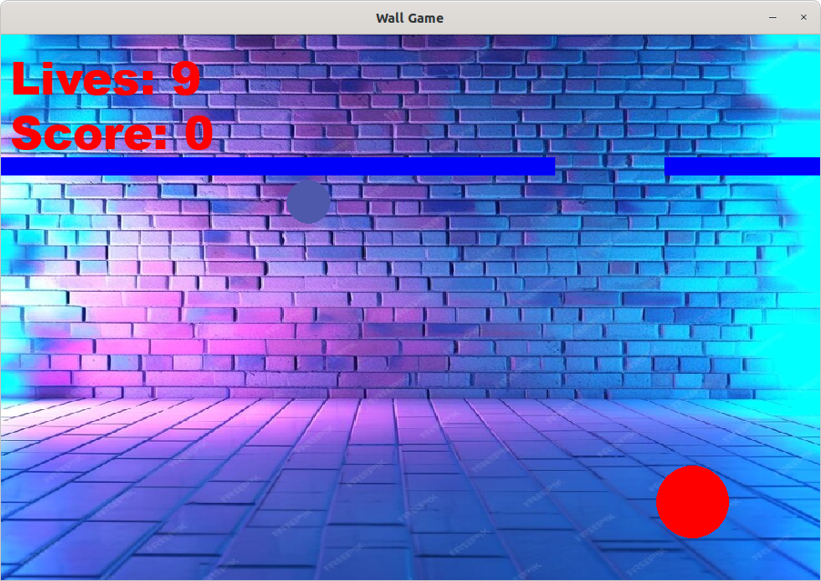
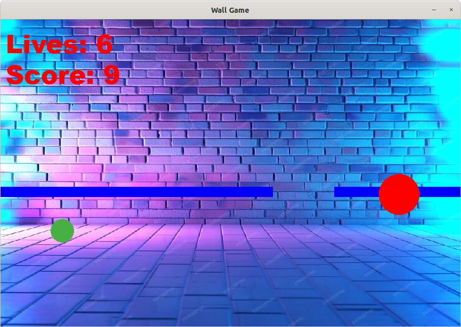
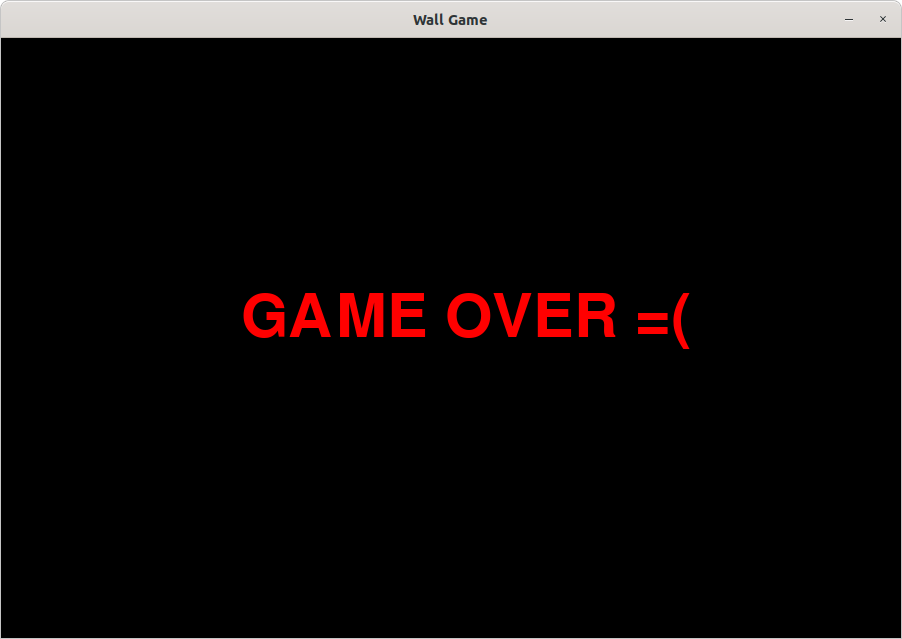

# wall-game

Wall Game developed with PyGame

## Installation

1. Clone the repository
2. Install the required packages with `pip install -r requirements.txt`
3. Run the game with `python main.py`

## How to play

Navigate your circle using the mouse through the holes in the descending walls. 
Avoid the bouncing balls, as they will cause you to lose lives. 
Additionally, ensure your circle passes through the holes accurately. 
Failing to do so will drag your circle down, costing you life and changing your circle's colour and size. 

The game ends when you lose all your lives.  

## Screenshots

